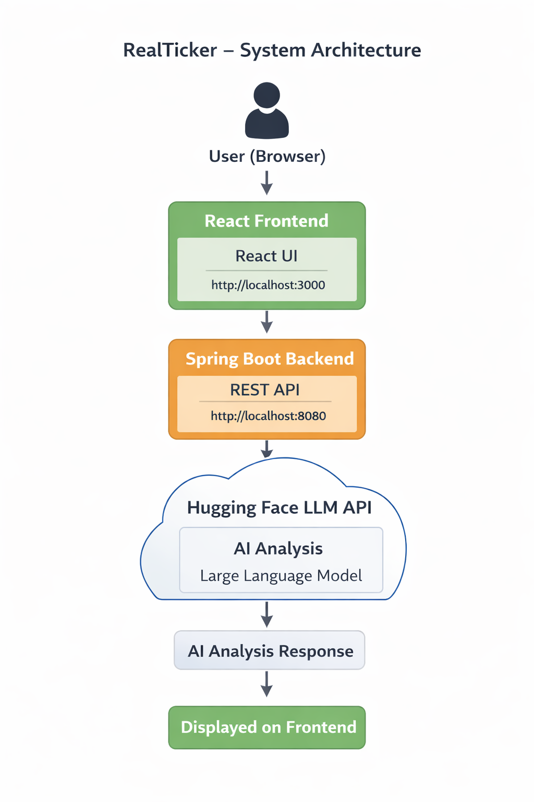

## ** RealTicker – AI Powered Stock Insights Platform**

## **Overview**

RealTicker is a full-stack web application that helps users understand stock market trends using historical price data and AI-generated insights.

The application displays stock data, shows 6 months of historical prices, and uses a Large Language Model (LLM) from Hugging Face to generate beginner-friendly investment analysis.

⚠ Disclaimer:
This application provides AI-generated insights and is not financial advice.


Users can:

* View the **Top 10 Stocks**
* Check **6-month historical price data**
* Generate **AI-based trend analysis, risk level, and investment suggestion**

The system integrates a **React frontend**, **Spring Boot backend**, and a **Hugging Face LLM API**.

---

## **Tech Stack**

| Layer        | Technology Used                 |
| ------------ | ------------------------------- |
| Frontend     | React.js + Bootstrap            |
| Backend      | Spring Boot (Java)              |
| API Client   | Axios                           |
| AI Model API | Hugging Face Inference API      |
| Build Tools  | Maven (Backend), npm (Frontend) |

---

## **Application Features**

* Display top 10 stocks in a tabular format
* View historical price data for each stock
* Generate AI analysis including:

  * Market Trend (Upward / Downward / Sideways)
  * Risk Level (Low / Medium / High)
  * Investment Suggestion (Invest / Watch / Avoid)
  
* Error handling and loading indicators

---

## **Project Structure**

```
RealTicker/
│
├── backend/ (Spring Boot)
│   ├── controller
│   ├── service
│   ├── model
│   └── application.properties
│
└── frontend/ (React)
    ├── App.js  (Single main component)
    ├── App.css
    └── package.json
```

---

## **System Architecture Flow**

The application follows a **3-layer architecture**:

```
User (Browser)
      ↓
React Frontend (UI)
      ↓
Spring Boot Backend (REST API)
      ↓
Hugging Face LLM API
      ↓
AI Analysis Response
      ↓
Displayed on Frontend
```

---

## **Architectural Diagram**

```


```

---

## **Setup Instructions**

### **1. Clone the Repository**

```bash
git clone <your-github-repo-url>
cd RealTicker
```

---

### **2. Backend Setup (Spring Boot)**

#### Install Requirements

* Java 17+
* Maven

#### Steps

```bash
cd backend
mvn clean install
mvn spring-boot:run
```

Backend runs on:
**[http://localhost:8080](http://localhost:8080)**

---

### **3. Frontend Setup (React)**

#### Install Requirements

* Node.js 16+

#### Steps

```bash
cd frontend
npm install
npm start
```

Frontend runs on:
**[http://localhost:3000](http://localhost:3000)**

---

## **LLM Integration**

The application uses a **Large Language Model (LLM)** hosted on **Hugging Face** to analyze stock trends.

### Models Used:

| Model Name                           | Purpose                               |
| ------------------------------------ | ------------------------------------- |
| `mistralai/Mistral-7B-Instruct-v0.2` | Instruction-based text generation     |
| `google/flan-t5-large`               | Text reasoning & structured responses |

### 🔑 Hugging Face API Token Required

This project uses the Hugging Face Inference API.  
You must provide your own API token to run AI analysis.
❌ The token is NOT stored in the repository for security reasons.


---

## **API Endpoints**

| Endpoint                       | Method | Description                         |
| ------------------------------ | ------ | ----------------------------------- |
| `/api/stocks/top10`            | GET    | Returns top 10 stocks               |
| `/api/stocks/{ticker}/history` | GET    | Returns 6-month price history       |
| `/api/stocks/{ticker}/analyze` | POST   | Returns AI-generated stock analysis |

---

## **Sample AI Response Format**

```json
{
  "trend": "Upward",
  "risk": "Medium",
  "action": "Invest",
  "disclaimer": "This is AI-generated analysis and not financial advice."
}
```
## ⚠ Note: LLM Model Status

The AI model integration is currently **not fully functional** due to Hugging Face inference limits and model availability.
If the AI analysis does not return a result, the rest of the application (stock data, history, UI) will still work normally.
This project demonstrates **LLM integration architecture**, even if the model response may fail in free-tier environments.